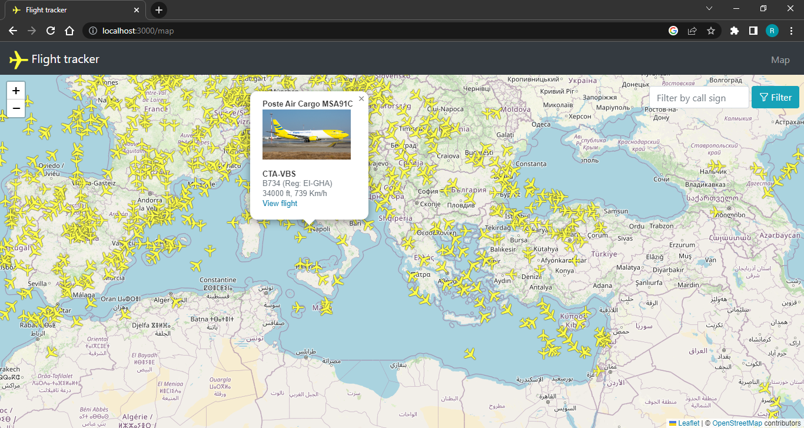
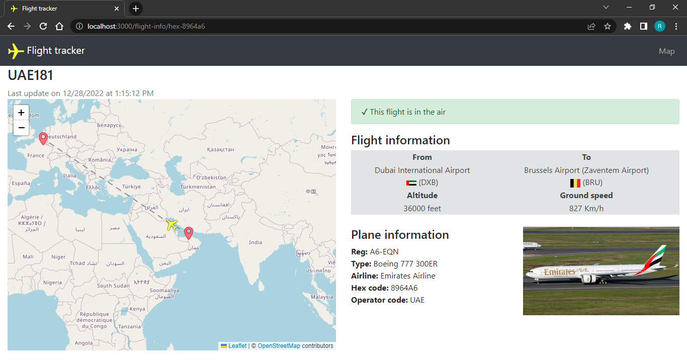

# Flight Tracker ✈️
An open-source project written with JavaScript

The goal of this project is to read the data from [OpenSky Network](https://opensky-network.org/) and visualize it on a map.

## DEMO 🧑‍✈️
 

## 🔮 Features:
- Fetching flight data from [OpenSky Network](https://opensky-network.org/).
- Using maps from [mapbox](https://www.mapbox.com/) with the React friendly wrapper [react-map-gl](https://github.com/visgl/react-map-gl).
- Using styling components from [MUI](https://github.com/mui-org) project.
- Using [Vite](https://vitejs.dev/) to serve the app.

## 🔌 Usage:
To use the maps from [mapbox](https://www.mapbox.com/), you need an appropriate token. You can create one on their website by registering there. Registration is free and all relevant things are covered for development purposes.

For the use of the flight data via [The OpenSky Network](https://opensky-network.org/), I would also recommend creating a corresponding account on their website. The flight data is then provided with a delay of ~5 seconds. Without an account, the delay is ~10 seconds.

Start by cloning the repository and install the packages:
```
npm install
```
```
npm run preview
```
